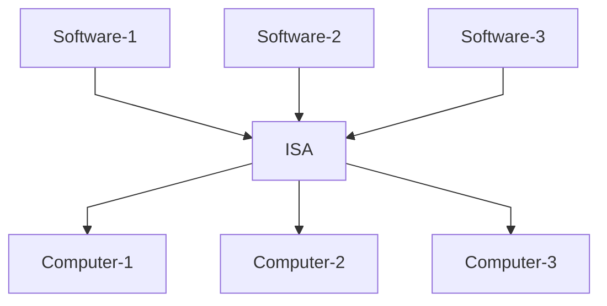

# The Abstract Computer: Why do we need it?

Before learning any programming language,
the first important idea to have in mind is that,
except for extremely limited cases,
**developers always code for abstraction of computers
and never target specific computer hardware**.
If you code in high-level languages like Python,
you target abstract computers;
if you code in lower-level languages like C,
you target abstract computers;
even if you write machine code directly
(machine code are binary sequences like 00111001010100111 which,
although barely readable for humans,
can run directly on computer hardware),
you are still targeting abstract computers.

Why is this?
Why do we need an extra layer of abstraction?
Wouldn't it be simpler to code for hardware directly?
There are two rationales behind abstract computers, as I will explain below.

## The Need for Standardization

As reflected in the [example of ISA](../developer-mindset/standards.md#an-example-of-standards) (Instruction Set Architecture)
provided in the previous module,
having a shared abstraction (a standard) across computers
allows the same software to run on different hardwares,
and the same hardware to run different applications.
That is, the significance of abstraction is that it is shared across different computers and software applications.

Without such a shared abstraction,
software applications target specific computer hardwares directly,
which means one software application can only run on one type of hardware,
e.g., one specific CPU model like Intel Core i7 12700H.
If we want to support different computers, we would have to code the software for each of them.
Conversely, a computer can only run the software applications that specific targets it.
As you can see, without a shared abstraction,
software development is extremely difficult and unproductive,
and the functionality of computers is extremely limited.

By targeting **abstraction** of computers, however, things become much easier:
as long as the computer share the abstraction which an application targets,
the application runs on that computer;
**all computers that share the same abstraction will be able to run any software application that targets that abstraction**,
as illustrated below:

<div style="text-align: center;">



</div>

For now, you can think of the lowest-level abstract computers as being Instruction Set Architectures (ISAs),
which are standards that define what operations a computer must support,
such as math operations like addition and multiplication.
At present, there are hundreds or even thousands of CPU models,
but there are only a few ISA families.
The most ubiquitous ISA family is x86 and is supported on almost every laptop and PC
(except for newer generation Macs).
In this case, targeting a shared abstraction (like x86) can be thousands of times more productive than coding for each specific hardware.

## Abstraction Makes Coding Easier

Instruction Set Architectures (ISAs) satisfy the need for standardization.
However, very few developers actually write assembly code
(i.e., code that uses ISA-defined operations directly)
or machine code
(i.e., binary code defined by the ISA standard which can run on hardware directly).
in modern days.
The reason is, ISAs are the lowest level of abstraction
which interface with hardware directly.
As a result, it is barely human-readable,
and it is very difficult to code large, complex applications with it.
An example of assembly code (x86) might look like this:

```asm
push   %rbp
mov    %rsp,%rbp
lea    0xe4c(%rip),%rax
mov    %rax,%rsi
lea    0x2e7e(%rip),%rax
mov    %rax,%rdi
call   1090 <_ZStlsISt11char_traitsIcEERSt13basic_ostreamIcT_ES5_PKc@plt>
mov    0x2dff(%rip),%rdx
mov    %rdx,%rsi
mov    %rax,%rdi
call   10a0 <_ZNSolsEPFRSoS_E@plt>
mov    $0x0,%eax
pop    %rbp
ret
```

(complete disassembly is omitted for brevity; this only shows the most crucial part of the code)

The function of the above code is to print "Hello World" to your computer's screen,
but you don't need to understand how it does that.
The key takeaway is that, coding for an ISA directly is anti-human.

As a result, developers need higher-level abstractions
that allow them to design, build and understand complex software systems with ease.
Roughly speaking, those abstractions are exactly what higher-level programming languages are.
For example, the above assembly code looks like the following in C++,
which is a popular low-level programming languages
(again, no need to understand what it's doing right now):

```cpp
#include <iostream>

int main() {
    std::cout << "Hello World" << std::endl;
    return 0;
}
```

And the code that does the same thing looks like the following in Python,
which is a higher-level programming language:

```python
print("Hello World")
```

As you can see, coding for higher level abstractions (programming languages)
makes coding much easier.
However, programming languages are not independent of each other,
and they are not monolithic pieces;
there are many abstractions that are shared across multiple programming languages.
For example, almost all programming languages have the concept of variables and structs;
low-level programming languages like C/C++ and Rust typically have the abstraction of stack and heap;
object-oriented or multi-paradigm languages like C++, Java and Dart usually have the concept of classes, objects and interfaces.
There is no need to understand what these words mean for now though,
as we'll illustrate them in later sections and modules.

Congratulations!
You have learned about abstract computers and the rationales behind them.
Next, we'll take a look at the lowest-level abstraction of computers
which is shared across all Instruction Set Architectures (ISAs).
