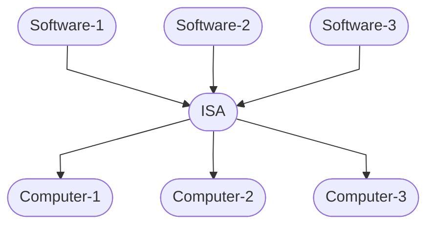

# Standards: Facilitating Interactions Between Entities

In the 18th century, guns were made by skilled gunsmiths;
every gun made in this way was a unique object.
This makes guns extremely expensive and hard to repair if broken,
as the only way to fix it is to send it back to the gunsmith and
have him/her repair his/her creation by hand.

So, in the mid-18th century,
a French gunsmith named Honoré LeBlanc suggested that gun parts be made standardized.
Standardized gun parts work with each other regardless of their creators;
in this way, if a gun is broken, it can be easily fixed by replacing the faulty part with a new one.

Although Honoré LeBlanc died a long time ago,
his idea of standardization lives on,
and became one of the foundations of modern software development.

In this section, we will discuss the idea of standardization and its significance.

## What is a standard?

Roughly speaking, a standard is **an abstraction shared across multiple entities**.
Such a definition contains two parts:

- **What is the abstraction?**
- **To what entities is the abstraction applicable?**

Standards are important, because:

- They provide a standardized way for multiple entities to interact with each other,
and as long as the interaction adheres to the standard, it is "guaranteed to work properly"; and
- When designing something, depending on "abstract standards" is better than depending on "concrete things",
as the former works with anything that adheres to the standard, while the latter works with only with a specific thing.

Let's look at an example to understand the idea better.

## An Example of Standards

One notable example of standards are Instruction Set Architectures (ISAs).
An ISA is basically an abstraction of a computer,
which defines what operations it must support,
such as math operations like addition and subtraction.

The previous definition of a standard applies to an ISA:

- *What is the abstraction?*
The abstraction is the set of operations that must be supported, defined by the ISA.
- *To what entities is the abstraction applicable?*
The standard (abstraction) is applicable to all computers that support the operations defined by the ISA.

Why is this important?
Well, have you wondered why software applications can run on different computers,
made by different vendors and equipped with different CPUs?
Each computer is different, and older computers and new ones likely don't have the same hardware,
so why does the same application work on both of them?

The answer is, a software application doesn't depend on a specific hardware;
instead, it depends on a certain ISA.
I.e., it only uses the operations defined by the ISA.
As the same time, different computers can **implement** (i.e., support the instructions defined by) the same ISA.
In this way, as long as a computer supports a certain ISA, it can run any software that targets it:
the software only uses the operations defined by the ISA;
the computer supports that ISA so that all ISA operations are guaranteed to work;
therefore, the software is guaranteed to work properly.

As you can see, an ISA serves as an "agreement" between software applications and computer hardwares;
as long as the software and the hardware interact with each other in a way that adheres to the ISA standard
(i.e., the software uses only the operations defined by the ISA, and the hardware supports the ISA),
the software is guaranteed to work properly.
Adhering the ISA standard brings tremendous benefits to both software and hardware developers:
without an ISA, software developers would have to program the same software for every computer,
whereas the ISA reduces that to programming the software only for a few ISAs;
such benefits applies to hardware manufacturers as well.

Congratulations! You have learned the idea of standards,
which is the an important concept that underlies virtually all software applications.
