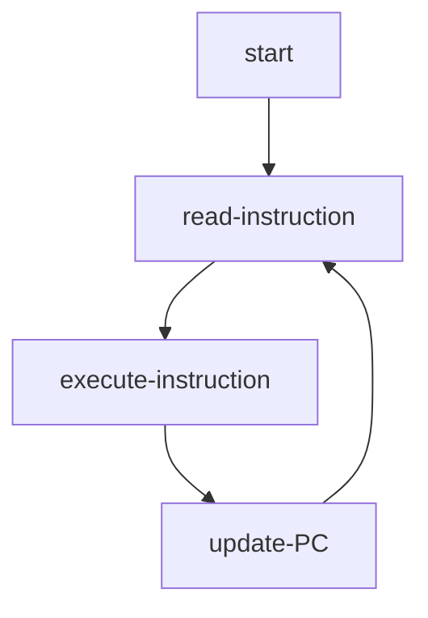

# Registers, Memory and Instructions: Instruction Set Architectures

Instruction Set Architectures (ISAs) are the lowest-level abstractions for computers.
ISAs are designed to be as close to hardware as possible,
while being general enough to be applicable to the majority of computers.
As such, ISAs are extremely human-unfriendly and
few developers actually code with them directly,
and higher level programming languages tend to abstract computers in a way completely different to ISAs.
However, understanding ISAs provides a good starting point to understanding how computer hardware works,
and it helps to explain a lot of design choices in higher-level programming languages and software applications,
which is why they're introduced here.

There exist multiple different ISAs, such as x86, ARM, MIPS and RISC-V.
Each of them is designed a little bit differently
(or quite differently, as in the case with CISC and RISC architecture families),
but there are some concepts that are shared across almost all of them.
These concepts are the fundamental abstraction that applies to almost all computer hardwares,
and are covered in this section.

## Registers, Memory and Instructions: The Most Generally-Applicable Abstraction of Computers

Virtually all ISAs employ the following concepts:

- There is a finite set of **registers** where you can hold data.
- There is a (virtually infinite) **memory** where you can hold more data.
Each location in the memory can hold some data,
and has an **address** associated with it;
you use that address to access the data stored in that location.
- There is a "processor" that supports executing a finite set of **instructions** which modify the registers or memory in some way.
- Instructions are stored in memory and executed in order;
- There is a special register (usually called the "**program counter**", or "**PC**")
that holds an address in memory;
at each point in time, the "processor" reads the data at that memory address,
interprets that data as an instruction, executes it, then updates the PC in some way.

There are several important things to notice in the above concepts:

- Compared to memory, registers can only hold very limited amount of data.
In most ISAs, the number of registers is less than 100,
and the total amount of data that can be held in all registers is unlikely to exceed 1 megabyte (MB).
On the contrary, memory is much larger: modern computers typically have anywhere from 4 to hundreds of gigabytes (GBs) of memory;
even cell phones typically have 4 or more gigabytes of memory.
- What a computer will do starting from a specific point in time
is completely determined by the data held in the registers (including the PC) and the memory.
You can think of the registers and the memory as the "**state**" of a program;
that state completely determines the program's behavior.
- The instructions supported by an ISA are generally very simple operations
(CISC, or "Complex Instruction Set Computers", which is a family of ISAs support more complex instructions,
but their functionalities are still extremely limited compared to complete computer programs),
such as "add up the data in register 5 and register 11, and store the result into register 0",
"load the value at memory address 122 to register 1", or "move the PC 40 memory addresses forward".
These instructions are not complete computer programs;
they are used as the building blocks of larger programs.
By composing these simple instructions (called "programming"),
one can create programs that do virtually anything.

!!! info "Why do we need registers?"

    You might wonder why we need registers at all:
    both registers and memory serve as the "state" of a program,
    so why can't we use memory exclusively?
    After all, registers can only store very limited amount of data,
    while memory is much larger.

    The answer relates to how computer hardwares work.
    Although registers are small, they are very fast;
    on the contrary, memory is large but also slow (compared to registers).
    As a result, the typical practice is to store the data that needs to be accessed frequently in registers,
    and the rest of the data in memory.

    This is a good example of how ISAs are close to hardware,
    and as you can see, although abstractions are "general and abstract characteristics",
    they typically depend on and reflect the underlying objects which they apply to.

!!! info "Other ISAs"

    Although what is introduced here is applicable to the vast majority of ISAs,
    there are ISAs that abstract computers differently.
    For example, [WebAssembly (WASM)](https://webassembly.org/)
    is a stack-based architecture which does not have registers.

## How are computer programs run?

Imagine a person with a pencil holding a notebook.
At the beginning, the notebook is on a certain page;
then, at each point in time, the person reads a page,
does something (either do some calculations and memorize the result, or write something to another page)
according to what that page says, changes to another page, and the same process goes on.

That is a good analogy of how a program gets run on a computer:
the person is the processor; the notebook is the memory,
and the person's brain memory is the registers.

As mentioned before, ISAs only support a very limited number of instructions
with very limited functionalities;
those instructions serve as the building blocks for larger software applications.
**Virtually every software application boils down to a large number (from hundreds to millions) of ISA instructions
when it gets run on the computer hardware**.
Basically, the way programs run, as defined by the ISAs, is like the following:

1. At the beginning, the memory and registers are initialized to some values.
Typically there is a special segment in the memory which holds all the instructions;
the instructions held in that segment are the "program".
2. At each point in time, the processor reads an ISA-defined instruction at the memory address specified by the PC,
executes it (either do some calculation and write the result to a register, or write some data to a certain memory address, etc.),
and updates the PC (usually to the memory address of the next instruction, but could also be somewhere else).
3. This process is repeated until the program is finished.

!!! info "What if there are multiple programs?"

    You may have wondered, what if there are multiple programs running on the same computer?
    Since they use the same piece of memory, won't they interfere with each other?
    And, how are they executed? Are they executed one by one or at the same time?

    The short answer is, the operating system provides another layer of abstraction which eliminates all these concerns.
    In simple words, the operation system "virtualizes" the computer hardware and
    creates the illusion of multiple, independent computers running at the same time.
    each program is allocated such a "virtual" computer of its own;
    in the program's view, there is nobody else on this computer, so no interference at all.

    How the operation system creates that illusion, though, is out of scope of this section.

## Conclusion

In this section, we talked about the lowest-level abstractions of computers: Instruction Set Architectures (ISAs).
Compared to other abstractions of computers, such as higher-level programming languages,
ISAs are closer to the hardware but also less human-friendly.
Although developers typically use completely different abstractions when programming,
understanding ISAs provides a good foundation of understanding how computers work.

Virtually all ISAs have a set of **registers**, a **memory** and define a set of supported, simple **instructions**.
One special register is called the **program counter (PC)**.
The way a program runs is basically "**fetch instruction at PC - execute instruction - update PC - repeat**".
ISA instructions serve as building blocks for more complex software applications;
**virtually every software application boils down to a large number of simple ISA instructions when it gets run on the hardware**.

Congratulations, you now understand how computer hardware works!
Real world computer hardwares are much more complicated than ISAs,
but for now, ISAs are a good approximation to the real hardware.

Next, we will introduce some higher level abstractions that
build upon ISAs and are found in most low-level programming languages like C/C++ and Rust.

## AI Prompt Samples

If you want to learn more about the topics in this section,
feel free to consult an AI such as ChatGPT.

Here are some sample prompts to get you started:

- Can you briefly describe the ARM architecture, as well as its instructions?
- Can you give an example ARM assembly code and explain what it's doing?
- What are the differences between CISC and RISC?
- How do Instruction Set Architectures compare to a Turing machine?
Why are there no registers in a Turing machine?
Why are there registers in ISAs?
- What are the most popular Instruction Set Architectures nowadays?
