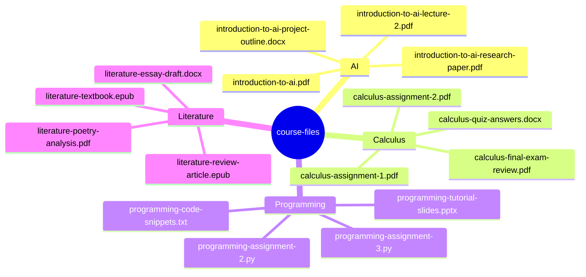
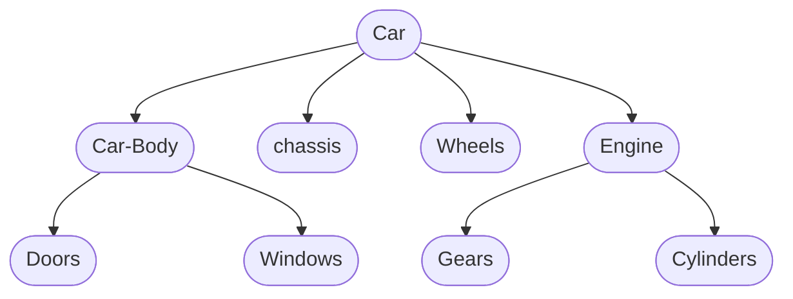
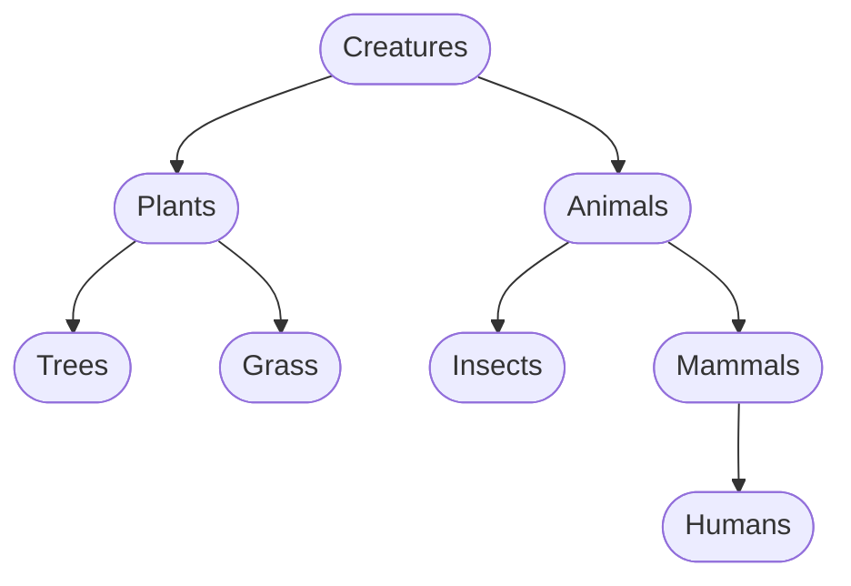

# Hierarchy: A Way to Manage Complexity

The second most important idea following abstraction is the idea of hierarchy.
Hierarchy is a way to manage complexity, and is found in almost every software application.

## What does "hierarchy" mean?

Broadly speaking, **the idea of hierarchy is about grouping things together and forming a tree of abstractions;
that "tree of abstractions" is called a "hierarchy"**.

That's a very abstract definition, so let's look at an example.

Suppose you are a college students and you have the following files for course assignments, PPT slides, etc.:

```txt
introduction-to-ai.pdf
calculus-assignment-1.pdf
programming-assignment-2.py
literature-textbook.epub
introduction-to-ai-lecture-2.pdf
calculus-assignment-2.pdf
programming-assignment-3.py
literature-review-article.epub
introduction-to-ai-project-outline.docx
calculus-final-exam-review.pdf
programming-code-snippets.txt
literature-essay-draft.docx
introduction-to-ai-research-paper.pdf
calculus-quiz-answers.docx
programming-tutorial-slides.pptx
literature-poetry-analysis.pdf
```

Man, that's a lot of files. And it looks messy, doesn't it?

A natural idea would be to group them into folders, for example:

```txt
course-files/
  AI/
    introduction-to-ai.pdf
    introduction-to-ai-lecture-2.pdf
    introduction-to-ai-project-outline.docx
    introduction-to-ai-research-paper.pdf
  Calculus/
    calculus-assignment-1.pdf
    calculus-assignment-2.pdf
    calculus-final-exam-review.pdf
    calculus-quiz-answers.docx
  Programming/
    programming-assignment-2.py
    programming-assignment-3.py
    programming-code-snippets.txt
    programming-tutorial-slides.pptx
  Literature/
    literature-textbook.epub
    literature-review-article.epub
    literature-essay-draft.docx
    literature-poetry-analysis.pdf
```

That looks much better, right?
Files for the same subject are grouped together,
and this way, you can find what you need much more easily.

That is the idea of hierarchy.
Recall the definition of hierarchy:
*the idea of hierarchy is about grouping things together and forming a tree of abstractions*.
Here, we group the files together according to the subject they belong to.
You might ask: "where's the 'tree of abstractions'?"
Well, the above directory structure can also be represented using the following graph:

<div style="text-align: center;">



</div>

This looks just like the branches of a tree.
Each node in the tree represents an abstraction,
and the abstraction of the child relates to that of its parent.
For example, the abstraction of the "course-files" folder might be
"all the files for the college courses";
its children are "AI", "Calculus", "Programming", and "Literature",
and each of these folders abstracts away "all the files for a certain course",
which is a part of "all the files for the courses".

Now that you have a rough understanding of hierarchy,
let's look at some common types of hierarchies to understand the idea better.

## Common Types of Hierarchy

### Composition

Composition is possibly the most common type of hierarchy.
A composition hierarchy is a hierarchy where, in the tree of abstraction,
the parent **contains** the children.

The previous course files example is a composition hierarchy.
In this example, "course-files" folder is the parent of "AI", "Calculus", "Programming", and "Literature" folders;
the folder for each course is the parent of the files of that course.
"course-files" contains the course folders;
each course folder contains its files.
That is, the parent contains the children.

Another example is a car.
On the highest level, a car consists of a car body, engine, chassis, and the wheels.
Then, the car body contains doors and windows,
the engine contains gears and cylinders,
and so on.

<div style="text-align: center;">



</div>

### General-to-Specific Hierarchy

Another common type of hierarchy is the general-to-specific hierarchy.
In a hierarchy of this type, the parent **generalizes** its children,
and its abstraction is the intersection of the natures of the children.

For example, consider the following hierarchy:

<div style="text-align: center;">



</div>

In this hierarchy, "Animals" is a type of "Creatures";
"Mammals" is a type of "Animals";
and "Humans" is a type of "Mammals", etc.
That is, each child is a type of the parent,
plus some characteristics specific to itself;
the characteristics of the parent is common to all of its children.

## Why is hierarchy important?

Hierarchy is important, because it allows a system to be abstracted differently at different levels,
which makes it easier to design, understand and maintain.

Suppose we want to design a car.
Without a hierarchy, we would need to design every single part together,
from every bolt on the steering wheel to every gear in the engine.
As there can be tens of thousands of parts in the car,
it would be very hard to keep track of all of them
and make sure they all work together.

When the car is malfunctioning, we would need to check every part
to find the faulty one and replace it;
if we want to explain how the car works,
we would need to explain what each part does,
and the fact the all the parts cooperate to make up a functional car
would probably look like magic.

With the idea of hierarchy in mind, we would split up the car into more manageable pieces.
For example, we can have one team of engineers to work on the engine,
another team to work on the chassis, etc.
And the team that works on the engine may further split up the engine into smaller pieces to make sure they all work together.
The team that works on the engine does not need to know how the chassis works (generally); and vice versa.

When the car is malfunctioning, we would first check each high-level component
to see if it works correctly, identify the faulty component,
check all of its sub-components, until finally reaching the broken part;
although this is a lot of work as well,
it is much easier than checking through every bolt and gear.
If we want to explain how the car works,
we would first explain the function of each top-level components,
and then explain how the sub-components work together and make up a functional high-level component.
Obviously, it is much easier to explain the car this way
than first describe what each screw does, and "suddenly, the parts just magically become a working car".

In software development, "replacing the faulty part" roughly maps to fixing the faulty piece of code;
"explaining how the car works" roughly maps to understanding how the software is made up, so that you know how to write code for it.

As you can see, by decomposing complex systems and grouping things together,
the idea of hierarchy allows people to manage complexity, and to design and understand complex systems effectively.

Congratulations! You have now learned the idea of hierarchy.
Next, we are going to talk about the last concept in this module: standards.
