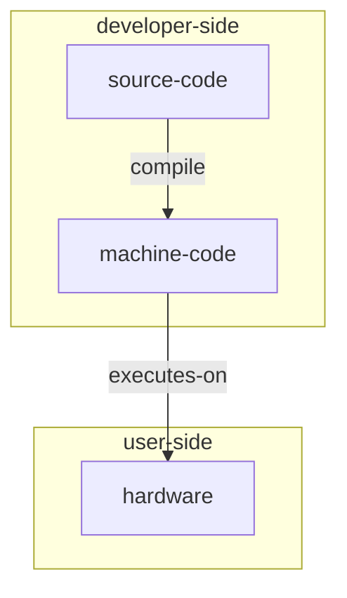
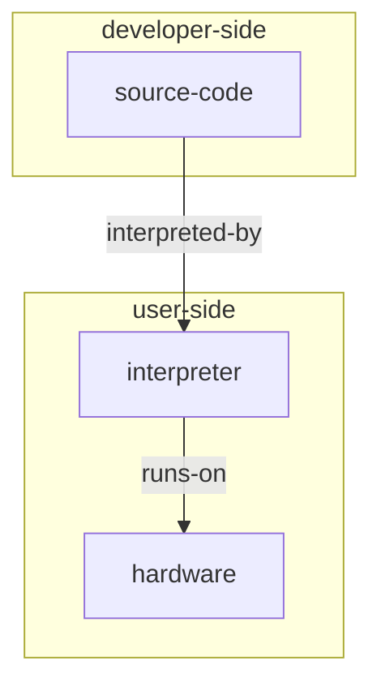
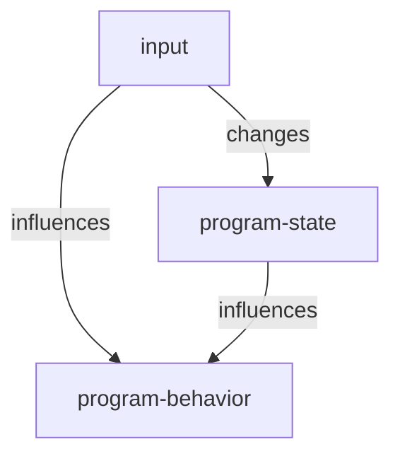
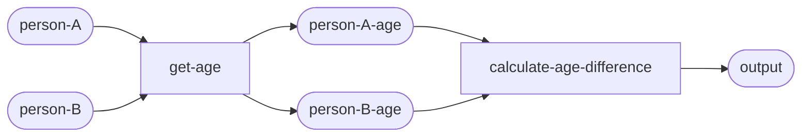

# Programming Languages: A High Level Overview

In this section, we are going to talk about
the purpose of programming languages and their general taxonomy.

## What are programming languages? Why do we need them?

Generally speaking,
a programming language is
**an abstraction of computers, designed to
make designing, representing, building and understanding computer programs easier for beings with a human-like mindset**.

Notice that programming languages are sometimes defined in a more liberal way, counting in assembly languages as well;
in this module, however, we define "programming language" to include only modern, "human-oriented" programming languages
such as C/C++, Python, Rust, Java, JavaScript, etc.;
we do not include languages that are not meant for use by humans,
such as assembly languages and binary machine codes.

Recall from the previous module that the lowest level
(closest to hardware) abstraction of a computer is an Instruction Set Architecture (ISA),
but programming with ISAs is very unintuitive for humans.
As a result, people decided to build higher-level abstractions that are easier to understand and use;
this is exactly what programming languages are for.

Since programming languages are high-level abstractions designed to be human-friendly,
their programming models are typically far away from the actual computer hardware (compared to ISAs).
For example, registers, a hardware detail found in almost every ISA, is abstracted away in almost every programming language.

!!! info "About registers"

    In modern CPUs, registers defined in ISAs are typically not actual hardware components,
    but they are not just abstractions either.

    There are "physical registers" in CPUs.
    However, they do not map to ISA-defined "architectural registers" directly.
    Instead, the typical case is that there are many more physical registers than architectural registers;
    the latter are mapped to the former in a many-to-many way at run-time via a technique called "register renaming".

Here are some commonly found concepts in programming languages,
compared with their "lower-level implementations" in ISAs (which are still abstractions over hardware):

| Programming Language Concept | ISA Implementation | Description |
| -------------------------- | ----------------- | ----------- |
| variable/constant | a chunk of memory which holds data | A "thing", like the string "Hello, World!", number 1.22, or a tree of data |
| function | typically a chunk of memory which holds ISA instructions (in compiled languages) | A tool which can do a certain thing |
| struct | not present at run-time (in compiled languages) | a definition for structured data, like "a student struct has name, age, and scores" |

## The General Taxonomy of Programming Languages

There are a large number of programming languages at present;
each of them has its own features, abstractions, tradeoffs and is fit for a specific set of use cases;
however, there are some commonalities between them,
and programming languages can be generally divided into large groups from multiple perspectives.

In this subsection, we will talk about some of the common ways to categorize programming languages,
and the general characteristics of languages in each category.

!!! info "The term "tradeoff""

    "Tradeoff" is a basic concept in both software and hardware development.
    Generally speaking, it means **to "trade" (sacrifice) the quality in one aspect for that in another**.

    For example, many programming languages (like Python) sacrifice speed and hardware efficiency for ease of use;
    others like C/C++, on the other hand, sacrifice ease of use and learning for better control over hardware and faster execution.

### Execution Model: Compiled v.s. Interpreted

One common way to categorize programming languages is by the execution model,
which can be either "compiled", "interpreted" or a hybrid between the two.

#### Compiled Languages

Recall from the previous section that
the run-time (i.e., the time when a program is run)
execution of virtually every computer programs boils down to
executing ISA-defined instructions on the hardware.

However, programming languages are designed for humans, not computer hardware;
so there has to be some way to convert software written in a programming language into machine-executable code,
either before or when the program is run.

**Compiled languages** choose the former.
In a compiled language, code that a developer writes (to form a full program or part of a program) in a programming language
is converted into machine-executable code by a piece of software called the **"compiler"**,
before the program is run.
Then, that software application in machine code form can run on hardware directly.

<div style="text-align: center;">



</div>

There are some terms associated with compiled languages:

- **Source code**: Code that a developer writes in a programming language.
- **Machine code**: Code that can run on hardware directly.
- **Compilation**: The process of converting source code into machine code.
- **Compiled application**: A piece of software that has been compiled (from source code), typically in machine-code form and can run on hardware directly.
- **Binary executable**: Since machine code is usually in binary form (e.g., 001100101010111000110),
compiled applications that can run on hardware directly are often referred to as "binary executables".
- **Compile**: The verb form of "compilation".
- **Compiler**: A piece of software that does compilation.
- **Compile-time**: The time when the compilation is performed.
- **Run-time**: The time when the program is run.

!!! info "Decompilation"

    You might wonder whether it is possible to convert machine code back to source code.
    Yes, that is indeed possible.
    Such a process is called **decompilation**,
    and there are a lot of **decompilers** out there which do decompilation.

The advantages of compiled languages are:

- Fast and hardware-efficient:
The biggest advantage of compiled languages is that they are fast and hardware-efficient.
The process of compilation makes sure that
**every instruction in the compiled application does useful job in the most efficient way possible**.
Many people would awe at the the wide range of optimizations that modern compilers can do,
from identifying and eliminating useless code in the source code,
to "rewriting" source code in a way that works better with the hardware.
Additionally, since compiled applications interface with the hardware directly
without introducing an intermediate layer (as in the case of interpreted languages),
they run much faster and use much less memory.
- (Sometimes) better bug-extermination:
In many cases (such as with variable types, as we'll introduce later),
the static nature of compiled languages means that many errors in the source code
can be detected at compile time, rather than resulting in glitches that users experience at run time.

The disadvantages:

- (Typically) harder to learn and use:
Since compiled languages are typically closer to hardware,
it takes more efforts to learn them.
It is usually harder to use them as well,
as being close to hardware means that you have to manage many things (especially memory) yourself,
instead of delegating that responsibility to a piece of software (as with most interpreted languages).
In addition, it often takes more code to write the same application in a compiled language than in an interpreted one.
- Less flexibility:
The static nature of compiled languages means it is harder to do certain things with it,
such as modifying the type of a variable at run-time.
- Hardware specific: Since machine code is the closest abstraction to hardware,
and that different operating systems typically have different binary executable formats,
compiled applications are usually unable to run on multiple operating systems,
or on hardware implementing different ISAs.
For example, applications compiled for Windows cannot run on Linux or macOS;
PC applications targeting x86 ISA cannot run on smartphones which typically implement the ARM ISA.

Some popular compiled languages:

- C/C++: Although created many, many years ago, C/C++ is still one of the most popular compiled languages in the world.
It offers the most control over hardware and unrivaled performance (if used in the right way).
However, it has a steeper learning curve,
and memory management is notoriously hard
(can be relieved by using stuff like smart pointers and RAII though).
- Rust: A modern, relatively new programming language.
It is one of the most difficult-to-learn languages in the world,
but once you get familiar with it, you will benefit a lot from its memory safety guarantees,
as well as its modern syntax and design which make it very intuitive and concise.

#### Interpreted Languages

Different from compiled languages,
interpreted languages choose to actually "execute" source code at run-time using a special piece of software called an **"interpreter"**.
An interpreter reads in each "high-level" instruction in the source code and executes it.

<div style="text-align: center;">



</div>

From one perspective, you can think that the source code gets executed by a "virtual hardware" (the interpreter) that understands it directly;
from another perspective, however, since the execution of an interpreter ultimately boils down to machine code,
you can think that the source code is converted to machine code by the interpreter dynamically at run-time.

For example, consider the following Python code:

```Python
a = 125
b = 137
c = a * b
print(f"The result of {a} times {b} is {c}")
```

Even if you have no experience with programming,
the code above should be straightforward to understand:
it multiplies 125 and 137, then prints the result to the console
(i.e., the terminal from which the code is executed).

How is that code executed by the interpreter?
Well, the interpreter actually reads and executes each line:

1. The first line `a = 125` is executed by allocating a piece of memory, naming it to `a` and writing 125 to it;
2. Similar thing happens when executing the second line `b = 137`.
3. The third line `c = a * b` is executed by reading the pieces of memory previously named to `a` and `b`,
multiplying them together and writing the result to an allocated piece of memory named to `c`.
4. The fourth line `print(f"The result of {a} times {b} is {c}")` is executed by reading `a`, `b` and `c`,
then printing them to the console.

!!! info "Note"

    The explanation above is not entirely correct in terms of what really happens on hardware.
    The actual execution of Python code is a complex process,
    considering how the interpreter "understands" source code,
    and the fact that the execution engine of the Python interpreter,
    namely the Python Virtual Machine,
    is a stack based system.

    But for now, don't worry too much about the hardware details;
    the explanation above provides a good illustration of the abstraction that interpreted languages provide.

The advantages of interpreted languages are:

- Their dynamic nature allows more flexibility in code.
For example, Python allows you to change the type of a variable (e.g., from an integer to a string) at run-time,
which is usually prohibited in compiled languages.
- They are often much easier to learn and use.
The interpreter provides a more human-friendly abstraction of computers which makes programming much easier.
Writing the same software in an interpreted language typically results in much shorter source code than in a compiled language.
Also, in interpreted languages, you typically do not need to manage memory manually;
the interpreter handles that for you.
- Better cross-platform and cross-ISA compatibility:
Since the interpreter offers another layer of abstraction to computer hardware,
software written in interpreted language can run on any computer with an interpreter for that language,
regardless of its ISA and operating system.

The disadvantages:

- Slow and hardware-inefficient.
Obviously, it is slower to read in, parse, and "simulate the execution" of each line of source by the interpreter,
compared to executing compiled machine code directly.
In reality, Python code can be anywhere from 20x to 200x slower than equivalent C++ code.
- (Sometimes) harder to debug:
The flexibility of interpreted languages also means they are harder to debug sometimes.
In the extreme case, all errors in interpreted languages are run-time errors,
because there is no compile-time analysis of the source code.
If there is a bug in an app that happens 1 in 1000 times,
there is a good chance that it's not spotted when developing the app,
but incurs a run-time error when an unlucky user opens it.

#### Hybrid Techniques

Except for the "pure" compiled/interpreted languages introduced above,
there are a few technologies that blur the boundary between them:

##### Just-In-Time (JIT) Compilation

This technology allows parts of the source code to be compiled at run-time.

JIT compilation offers a few advantages:

- The program can run on any computer with a JIT compiler installed.
- JIT is often faster than interpreted languages, since the JIT compiler compiles the source code to machine code.
- The JIT compiler can sometimes find more available optimizations than the "static compilers" of compiled languages,
because it can access the run-time states of the programs.

##### Intermediate Language (IL) and Virtual Machine (VM)

Some languages supports compiling the source code to an intermediate representation
that is neither human-readable nor hardware-executable.
At run-time, such an intermediate representation is executed by a piece of software called the **"virtual machine"**
(not to be confused with virtual machines in which you can install operating systems).
The most well-known example of this is Java and its bytecode representation.

Such a technique offers a tradeoff between speed and cross-platform compatibility:
since the source code is compiled to intermediate representation,
the compiler is able to do some compile-time optimizations;
and, the introduction of the virtual machine allows the intermediate representation
to be executed on any computer with the virtual machine installed.

It is important to note that the intermediate representation is **not** designed to be human readable,
as it is expected to be generated by the compiler, not written by the human developers.

### Programming Paradigms: Stateful v.s. Stateless

Another way to categorize programming languages is by their **programming paradigms**.
Basically, a "programming paradigm" is a mental model to design and understand computer programs,
or you can think of it as an abstraction of computers.
Most programming languages allow you to use different programming paradigms to build software,
but some of them encourage certain paradigms.

Generally speaking, there are two big families of programming paradigms: stateful and stateless.

#### Stateful Programming Paradigms & Object Oriented Programming (OOP)

Stateful programming paradigms employ the idea of **states**,
and are often equivalent to "object oriented programming" in modern days.

A **state** is something that can change during the execution of a program and influence its behavior.
Typically, these **states** are saved in chunks of memory allocated to a program.
It is important to note that in a stateful programming paradigm,
the behavior of a program depends on not only the inputs but also the states;
the program output can be different even if the inputs are the same.

For example, consider a simple application with a button and a saved number.
The number starts at 0; each time the button is pressed, the number is incremented by 1
and displayed on screen.
In this case, that "number" is the state of the program,
as it changes when the button is pressed and influences what is displayed on screen.

The following diagram illustrates the programming model of a stateful paradigm:

<div style="text-align: center;">



</div>

#### Stateless Programming Paradigms & Functional Programming

Stateless programming paradigms generally tend to abstract a computer program as **functions** (mathematical sense)
that transform inputs to outputs without any side effects;
the use of states is usually discouraged.
Stateless programming paradigms are usually referred to as "**functional programming**".

For example, consider a program that calculates the age difference between two people.
In a functional programming paradigm, such a process can be abstracted as the following diagram:

<div style="text-align: center;">



</div>

As you can see, the **only** job of each step of the processing
(either `get-age` or `calculate-age-difference`)
is to transform its input to its output;
there is no side effects (e.g., printing something to the screen or changing the contents of a piece of memory),
and the same input always results in the same output.
There is no state that influences the program's behavior in addition to program inputs.

#### Programming Paradigms and Programming Languages

Different programming paradigms have different advantages and disadvantages.
For example, functional programming allows developers to understand the behavior of a program more easily
(the behavior of a stateful program is more unpredictable, especially in the case of concurrency,
as it depends on both the inputs and the states),
while stateful programming paradigms are more powerful in terms of what programs you can build with it.

As a result, most software applications employ different programming paradigms in different aspects,
instead of using one paradigm exclusively.
One common practice is to design the high-level structure of a program as stateful objects
(i.e., things with states),
then employ functional programming in implementing the functionalities of those objects.

Similarly, most modern programming languages support multiple paradigms.
However, some of them may encourage one paradigm or another by design.

For example, some programming languages supporting the stateful paradigm / object oriented programming are:

- Java: Java is one of the most popular language designed for object oriented programming (OOP).
- C/C++: C/C++ is a multi-paradigm language with good feature support for OOP.
- Python: Python is also a multi-paradigm language.
- Rust: Rust is a multi-paradigm language that encourages functional programming,
but it supports OOP as well.

Some programming languages supporting the stateless paradigm / functional programming are:

- LISP: LISP is one of the oldest programming languages.
It has a peculiar design that encourages what is called functional programming in the modern days.
- Rust: As mentioned before, Rust is a multi-paradigm language that primarily encourages functional programming.
- Python: As mentioned before, Python is also a multi-paradigm language with no strong inclination to either functional programming or OOP.

### General Purpose Languages v.s. Domain Specific Languages (DSLs)

The third way to categorize programming languages is by the areas they apply to.
Programming languages can be categorized into two large groups in this way:
**general purpose** languages and **domain specific languages (DSLs)**.

#### General Purpose Languages

General purpose languages are programming languages designed for general use.
I.e., those you can use to build software for any task.
Most of the languages we've mentioned before fall into this category,
including C/C++, Python, Rust and Java.

#### Domain Specific Languages

Domain Specific Languages (DSLs) are languages designed for specific fields,
like mathematics, database operations, data analysis and artificial intelligence.
Strictly speaking, a lot of DSLs do not match the definition of programming languages introduced in this section,
because they are not designed to build software;
however, if you generalize the definition of programming languages into
"an abstraction or a model that makes it easy to do certain things",
then DSLs do fit with this definition.

Some examples of DSLs:

- SQL: SQL is a DSL designed for database operations.
- Mermaid: Mermaid is a DSL that allows you to efficiently represent graphs, flowcharts, mindmaps, etc., in textual form.
- Slint: Slint is a UI (User Interface, like buttons, windows and slide bars) framework which provides a DSL to represent UI elements.
- Bash: Bash can be thought of as a DSL that makes it easier to do things on the terminal.
- MATLAB: MATLAB is a popular DSL for mathematics and supports various mathematical concepts and operations like matrix and matrix inversion.

!!! info "Fun Fact (Opinion): Developer's Review"

    Personally, I feel it's a miracle that MATLAB remains to be one of the most popular languages,
    considering its hideous IDE, archaic syntax and anti-human design
    (such as indexing arrays from 1 using braces, while everyone else uses 0 and brackets).

    Although MATLAB was the first language I learned seriously,
    it is now my least favorite and least-used language.
    I would strongly discourage any new developer to use MATLAB as his/her primary language,
    and strongly encourage current MATLAB users to switch to Python,
    both for their own good and for the development of the open-source community.

## Conclusion

In this section, we discussed what programming languages are and their general taxonomy.

Generally speaking, a programming language is **an abstraction of computers, designed to
make designing, representing, building and understanding computer programs easier for beings with a human-like mindset**.

Programming languages can be categorized in 3 different ways:

1. By execution model:
    - Compiled Languages: Source code compiled to machine code before program execution.
    - Interpreted Languages: Interpreter executes source code directly.
    - Hybridization techniques: Just-In-Time (JIT) Compilation and Intermediate Language (IL) & virtual machines.
2. By programming paradigm:
    - Stateful paradigm & Object Oriented Programming (OOP): Program include states which modify its behavior in addition to inputs.
    - Stateless paradigm & Functional Programming: Program abstracted as functions that transform inputs to outputs without any side effects;
    use of states is discouraged or prohibited.
3. By applicable fields:
    - General Purpose Languages: Programming languages that can be used to build virtually any program for anything.
    - Domain Specific Languages (DSLs): Programming languages designed for specific fields.

Congratulations!
You now have a high-level understanding of programming languages.
Next, we'll take a look at the common abstractions and ideas found in almost every modern, general purpose language.
